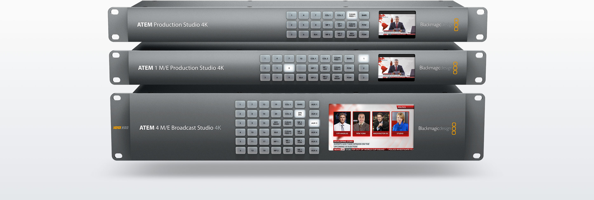
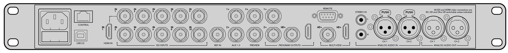
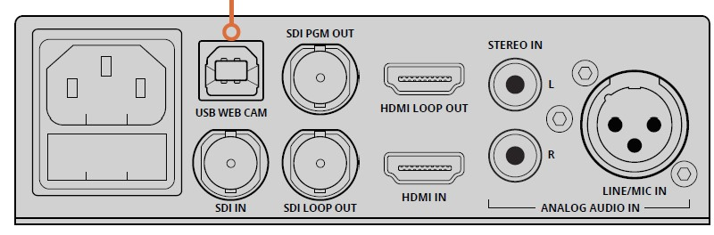

# 上海科技大学 eMotiV Studio 社团直播设备使用说明

## 简介

此文档将主要关注以下几个方面

1. 目前社团在活动直播时使用的各种设备以及使用方法。

2. 往期直播中遇到过的坑，以及解决方法。

3. 本文档以及相关材料的更新方法。

社长在新的直播工作群时，应当此 repo 的链接同时贴在该群的群公告中，并要求大家阅读此文档。

## 目前使用设备

### ATEM 1 M/E Production Studio 4

中间那个是我们现在使用的型号

背面的接口如上图所示

需要接的线有：

1. 电源线。

2. 网口，连接 [ATEM 1 M/E Broadcast Panel](#ATEM-1-M/E-Broadcast-Panel)。

3. 各路视频输入（SDI INPUTS）。其中：

    - 电脑输入插入 HDMI IN

    - 其余输入从 IN 2 开始依次插入剩余的 SDI 口

    注意：两个 IN 1（HDMI/SDI）只能同时插入一个。方便起见已在软件中默认使用HDMI。即使不需要使用 HDMI 输入也不建议使用剩余的 SDI 口。

4. AUX 1-3，一路作为大屏幕（会议中心）输出，一路作为直播流输出，还有一路根据需要使用。具体哪路负责什么随意，但务必牢记。

5. PROGRAM OUTPUTS，从1或2中随意挑选一路接入 [HyperDeck Studio 12G](#HyperDeck-Studio-12G) 的 In 口。

6. MULTI-VIEW，SDI 口连接 [SmartView HD](#SmartView-HD) 的 SDI IN。

7. ANALOG AUDIO IN的两个卡农口，其中CH 1是左声道，CH 2是右声道，连接调音台的音频输出。

### HyperDeck Studio 12G

俗称录机。

需要接的线有：

1. 电源线。

2. 最左侧的IN，连接 [ATEM 1 M/E Production Studio 4](#ATEM-1-M/E-Production-Studio-4) 的 AUX 中的直播输出。

3. 前面板的SSD（严格意义上不叫线吧），并记得格式化成exfat。

### SmartView HD

就那个大黑箱子最顶上一块屏，懒得找图了

需要接的线有：

1. 电源线（有一个电源适配器，只有这块屏能用的）。

2. SDI IN，连接 [ATEM 1 M/E Production Studio 4](#ATEM-1-M/E-Production-Studio-4) 的 MULTI-VIEW。

### ATEM 1 M/E Broadcast Panel

俗称台子。

就那个大纸盒子里的那个，懒得找图了

需要接的线有：

1. 电源线（一根即可，第二个口是冗余的，但就学校那个环境也用不着）

2. 网线，随意找一个接口接到 [ATEM 1 M/E Production Studio 4](#ATEM-1-M/E-Production-Studio-4) 的网口上。

    如有连接电脑设置相关选项的需要，可使用第二个接口连接到电脑上操作。

### Web Presenter

就一个小盒子，懒得找图了

接口如上图所示。

需要接的线有：

1. 电源线

2. SDI IN，接 [HyperDeck Studio 12G](#HyperDeck-Studio-12G ) 的 LOOP OUT。

3. USB WEB CAM，接电脑（可能需要找一个这样的线）

## 曾经遇到的坑

1. Web Presenter在Mac上使用OBS推流时会丢失音频输入。

    解决方法：换Windows的电脑推……这个真没啥办法，似乎是驱动问题，但怎么更似乎都修不好

2. HyperDeck（录机）一定记得在活动开始前就开始录制，否则后期会没有可用的音频流。

## 本文档及相关材料更新方法

以下几条注意事项请务必遵守：

1. 现任社长/副社长应在自己的 Github 账户上 fork 此 repo，并负责更新相关部分（将来可以考虑开一个社团专属repo）。

2. 在购入新的直播设备时，社长应当及时更新群文件中的“直播设备说明书”。若为此项购入为升级性质，及时清理不再需要的说明书文件。

3. 在以下情况下，应当更新本文档。

    1. 购入了新的直播设备。此时应当更新[目前使用设备](#目前使用设备)下的相关栏目。

    2. 在直播中遇到了新的坑。此时应当更新[曾经遇到的坑以及解决方案](#曾经遇到的坑以及解决方案)下的相关栏目。
